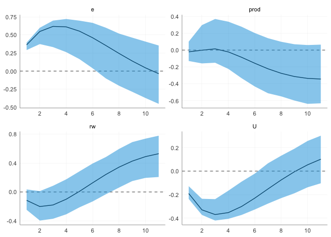
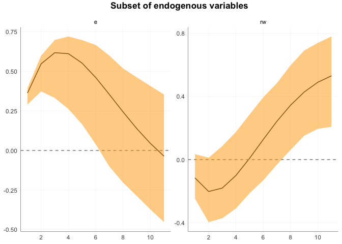

# `ggirf`

This package provides ggplot2 support for impulse response analysis in
various packages such as `vars`, `lpirfs`, `BGVAR` used for
macroeconomic analysis. The library includes custom colors and a ggplot2
theme. You can optionally provide different colors.

## Installation

You can install the development version of `ggirf` from
[GitHub](https://github.com/) with:

``` r
# install.packages("devtools")
devtools::install_github("muhsinciftci/ggirf")
```

## Contribution

Should you want to contribute to this package, please make a pull
request via this repo

## VAR impulse response analysis via `vars` package

``` r
library(vars)
#> Loading required package: MASS
#> Loading required package: strucchange
#> Loading required package: zoo
#> 
#> Attaching package: 'zoo'
#> The following objects are masked from 'package:base':
#> 
#>     as.Date, as.Date.numeric
#> Loading required package: sandwich
#> Loading required package: urca
#> Loading required package: lmtest
library(tidyverse)
#> ── Attaching core tidyverse packages ──────────────────────── tidyverse 2.0.0 ──
#> ✔ dplyr     1.1.4     ✔ readr     2.1.4
#> ✔ forcats   1.0.0     ✔ stringr   1.5.1
#> ✔ ggplot2   3.5.1     ✔ tibble    3.2.1
#> ✔ lubridate 1.9.2     ✔ tidyr     1.3.0
#> ✔ purrr     1.0.2
#> ── Conflicts ────────────────────────────────────────── tidyverse_conflicts() ──
#> ✖ stringr::boundary() masks strucchange::boundary()
#> ✖ dplyr::filter()     masks stats::filter()
#> ✖ dplyr::lag()        masks stats::lag()
#> ✖ dplyr::select()     masks MASS::select()
#> ℹ Use the conflicted package (<http://conflicted.r-lib.org/>) to force all conflicts to become errors
library(ggirf)
```

``` r
var_estimation <- vars::VAR(Canada, p = 2, type = "const")
var_irf        <- vars::irf(var_estimation)
```

and the impulse response graph via `ggirf` would be:

``` r
gg_vars(irf_result = var_irf, var_shock = 'e') +
  gg_theme_irf() +
  scale_x_continuous(minor_breaks = NULL, n.breaks = 6)
```

 or
you can simply provide one variable as well. **Providing multiple shocks
once is not allowed.** Providing a subset of endogenous variables at
once is allowed though.

``` r
gg_vars(irf_result = var_irf, var_shock = 'e', var_endo = c('e', 'rw'), shade_color = 'orange') +
  gg_theme_irf() +
  scale_x_continuous(minor_breaks = NULL, n.breaks = 6) +
  ggtitle('Subset of endogenous variables')
```



## Local projections impulse response analysis via `lpirfs` package

To be added here…
